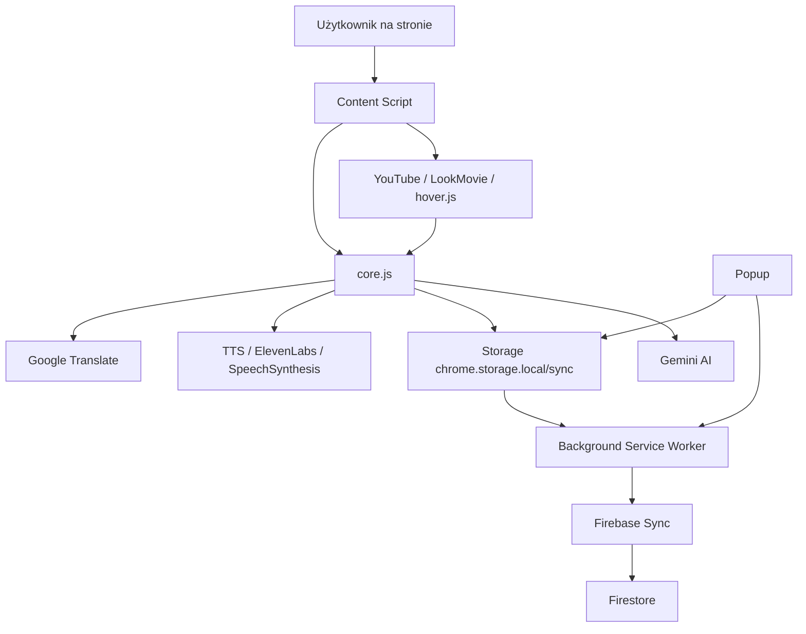

# Lectoro - Translation & Reader

## 1. Przegląd projektu

To jest rozszerzenie przeglądarki Chrome/Chromium typu MV3 (Manifest V3), które umożliwia:

- tłumaczenie zaznaczonego tekstu na stronie,
- odczyt głosu oryginału i tłumaczenia,
- zapisywanie słów i zdań do lokalnej bazy danych,
- powtórki słówek z systemem spaced repetition,
- eksport do Anki / CSV,
- opcjonalną synchronizację między urządzeniami przez Firebase Firestore,
- wsparcie dla stron takich jak YouTube, LookMovie oraz dowolnych stron z normalnym tekstem.

Projekt jest zbudowany jako rozszerzenie z wieloma skryptami content scripts, usługą tła i oknem popup.

---

## 2. Czym jest ten projekt?

To rozszerzenie działa jak „inteligentny tłumacz do nauki języków”:

1. Użytkownik zaznacza słowo lub frazę na stronie.
2. Rozszerzenie pokazuje overlay z tłumaczeniem.
3. Użytkownik może odczytać tekst, zapisać słowo lub zdanie i dodać je do swojej listy.
4. Zapisane elementy są przechowywane lokalnie i mogą być później powtarzane.
5. Dodatkowo można eksportować je do Anki lub CSV.

Projekt łączy funkcjonalność:

- translatora w locie,
- narzędzia do nauki słownictwa,
- interfejsu do powtórek,
- integracji z usługami zewnętrznymi (Google Translate, Gemini, Firebase, ElevenLabs).

---

## 3. Architektura projektu

### 3.1 Główne komponenty

- [manifest.json](manifest.json) – definicja rozszerzenia: uprawnienia, service worker, content scripts, popup.
- [background.js](background.js) – warstwa tła rozszerzenia. Zajmuje się synchronizacją, alarmami, powiadomieniami, komunikacją z Firebase.
- [content.js](content.js) – skrypt odpowiedzialny za interakcję z zaznaczonym tekstem na stronie (ikona, tooltip, TTS, zapis słów).
- [core.js](core.js) – rdzeń aplikacji. Zawiera wspólne funkcje: tłumaczenie, TTS, UI tooltipów, zapisywanie słów, AI, helpery do napisów.
- [youtube.js](youtube.js) – integracja z YouTube. Obsługuje napisy, hover/click, tryb Reels, wyjaśnienie AI.
- [lookmovie2.js](lookmovie2.js) – integracja z LookMovie. Obsługuje napisy wideo i kliknięcia na słowa.
- [hover.js](hover.js) – dodatkowy moduł obsługi hover/translate na stronach ogólnych.
- [popup.html](popup.html) – UI popupu rozszerzenia.
- [popup.js](popup.js) – logika popupu: ustawienia, lista słów, powtórki, eksport, synchronizacja.
- [styles.css](styles.css) – wspólne style dla tooltipów, popupu i interfejsu rozszerzenia.
- [firebase-config.js](firebase-config.js) – konfiguracja Firebase.
- [firebase-sync.js](firebase-sync.js) – wrapper do autoryzacji i Firestore.
- [firebase.json](firebase.json) i [firestore.rules](firestore.rules) – konfiguracja backendowej części Firebase.

---

## 4. Jak to jest połączone?

### 4.1 Schemat przepływu



### 4.2 Najważniejsze zależności

- Wszystkie skrypty stron internetowych opierają się na [core.js](core.js), który dostarcza wspólne narzędzia.
- [content.js](content.js) jest „warstwą interfejsu użytkownika” dla ogólnej obsługi zaznaczeń.
- [youtube.js](youtube.js) i [lookmovie2.js](lookmovie2.js) są specjalizowanymi modułami dla konkretnych stron.
- [popup.js](popup.js) komunikuje się z tym samym storage co moduły content scripts.
- [background.js](background.js) pełni rolę pośrednika między popupem, storage i Firebase.

---

## 5. Szczegółowy opis plików

### [manifest.json](manifest.json)

Definiuje rozszerzenie MV3.

Najważniejsze elementy:

- `permissions`: `storage`, `alarms`, `notifications`, `identity`
- `background.service_worker`: [background.js](background.js)
- `action.default_popup`: [popup.html](popup.html)
- `content_scripts`: skrypty wstrzykiwane na wszystkie strony (`<all_urls>`)

### [background.js](background.js)

To główny punkt koordynacyjny dla funkcji systemowych:

- synchronizacja słów między urządzeniami,
- sync fallback do `chrome.storage.sync`,
- obsługa alarmów i przypomnień o powtórkach,
- powiadomienia o zbliżających się powtórkach,
- komunikacja z Firebase przez [firebase-sync.js](firebase-sync.js).

### [core.js](core.js)

Ten plik jest sercem rozszerzenia. Zawiera:

- stałe i helpery UI,
- tooltipy i overlaye,
- funkcje tłumaczenia (Google Translate),
- TTS (SpeechSynthesis i ElevenLabs),
- zapis słów do pamięci lokalnej,
- generowanie zdań AI przez Gemini,
- pomocnicze funkcje dla napisów i captionów,
- mechanizm podziału tekstu na słowa lub zdania.

### [content.js](content.js)

Odpowiada za interakcję użytkownika z zaznaczonym tekstem:

- tworzy ikonę nad zaznaczeniem,
- pokazuje tłumaczenie w tooltipie,
- umożliwia odczyt głosu,
- obsługuje zapis słowa/zdania,
- wspiera czytanie zdania po zdaniu.

### [youtube.js](youtube.js)

Specjalna warstwa dla YouTube:

- wykrywa napisy YouTube,
- zamienia słowa w napisach na klikalne elementy,
- pozwala na hover/click do tłumaczenia,
- wspiera tryb Reels (przegląd słów z napisów),
- umożliwia „wyjaśnienie AI” całego zdania po naciśnięciu Enter.

### [lookmovie2.js](lookmovie2.js)

Podobna funkcjonalność jak dla YouTube, ale dostrojona pod LookMovie:

- obsługa napisów w video.js,
- hover i click na słowa w napisach,
- tłumaczenie całego zdania z kontekstu,
- kontrola prędkości odtwarzania,
- szybkie wyjaśnienie AI całej linijki.

### [hover.js](hover.js)

Dodatkowy moduł dla ogólnych stron. Jest przeznaczony do bardziej uniwersalnej obsługi hoverowania i tłumaczeń.

### [popup.html](popup.html) i [popup.js](popup.js)

Popup jest centralnym panelem zarządzania:

- wybór języka docelowego,
- ustawienia głosu i szybkości TTS,
- konfiguracja ElevenLabs,
- klucz Gemini API,
- lista zapisanych słów,
- filtrowanie słów,
- eksport do Anki / CSV,
- panel powtórek spaced repetition,
- synchronizacja Firebase.

### [styles.css](styles.css)

Zawiera wszystkie style UI:

- tooltipy,
- przyciski tłumaczenia i odczytu,
- popup,
- listę słów,
- komponenty powtórek,
- efekty wizualne overlayów.

### [firebase-config.js](firebase-config.js)

Zawiera podstawową konfigurację Firebase. Jest wymagane do uruchomienia synchronizacji z chmurą.

### [firebase-sync.js](firebase-sync.js)

Implementuje warstwę komunikacji z Firebase:

- logowanie przez Google OAuth,
- pobieranie/aktualizacja tokena,
- autoryzacja,
- odczyt/zapis danych w Firestore,
- usuwanie dokumentów słów.

### [firebase.json](firebase.json) i [firestore.rules](firestore.rules)

Konfiguracja dla Firebase Hosting / Firestore rules. W praktyce projekt wykorzystuje Firestore jako backend do synchronizacji.

---

## 6. Model danych

Najważniejszy obiekt zapisany w local storage to słowo/wyrażenie.

Przykładowa struktura:

```js
{
  original: "hello",
  translated: "cześć",
  sentence: "Hello world",
  sentenceTranslated: "Cześć świecie",
  srcLang: "en",
  tgtLang: "pl",
  timestamp: 1712345678901,
  url: "https://example.com",
  downloaded: false,
  screenshot: "data:image/jpeg;base64,...",
  sr: {
    step: 2,
    interval: 7,
    nextReview: 1712450000000,
    lastReview: 1712345678901
  },
  updatedAt: 1712345678901
}
```

### Kluczowe pola

- `original` / `translated` – główna para słowo-tłumaczenie.
- `sentence` / `sentenceTranslated` – kontekst zdaniowy.
- `srcLang` / `tgtLang` – języki źródłowy i docelowy.
- `screenshot` – zrzut ekranu z momentu zapisania.
- `downloaded` – flaga wskazująca, czy element był już eksportowany.
- `sr` – dane spaced repetition do powtórek.

---

## 7. Jak działa zapis i powtórki

### 7.1 Zapisanie słowa

Po kliknięciu przycisku „Zapisz” w tooltipie:

1. Tworzony jest obiekt wpisu.
2. Zapis jest dodawany do `chrome.storage.local`.
3. Jeśli użytkownik jest zalogowany do Firebase, dane mogą zostać zsynchronizowane z Firestore.

### 7.2 Powtórki

Powtórki działają na podstawie danych w polu `sr`:

- `step` – numer kroku w systemie interwałów,
- `interval` – aktualny odstęp czasowy,
- `nextReview` – czas następnej powtórki,
- `lastReview` – ostatnia data oceny.

Popup renderuje kolejkę słów, które są już „due” (czas minął) i pozwala ocenić je w skali 1–5.

---

## 8. Synchronizacja i Firebase

Projekt ma dwa tryby synchronizacji:

### 8.1 Fallback lokalny

Bez Firebase dane są przechowywane w:

- `chrome.storage.local` – lokalne słowa użytkownika,
- `chrome.storage.sync` – backup / prosty sync między urządzeniami (chunked JSON).

### 8.2 Firebase Firestore

Jeśli konfiguracja Firebase jest gotowa:

- użytkownik loguje się przez Google OAuth,
- token jest przechowywany lokalnie,
- rozszerzenie pobiera i zapisuje słowa do Firestore.

To umożliwia pełen sync między urządzeniami.

> Warto pamiętać, że Firestore wymaga własnego projektu Firebase i odpowiednio ustawionych reguł bezpieczeństwa.

---

## 9. Integracje zewnętrzne

### Google Translate

Służy do tłumaczenia słów i zdań w czasie rzeczywistym.

### Gemini AI

Rozszerzenie wykorzystuje Gemini do:

- generowania praktycznego zdania z użyciem słowa,
- wyjaśniania znaczenia całego zdania po angielsku/polski.

### ElevenLabs

Opcjonalnie umożliwia wygenerowanie głosu TTS z lepszą jakością niż domyślne SpeechSynthesis.

---

## 10. Jak uruchomić projekt lokalnie

### Wymagania

- Chrome lub Chromium
- lokalnie pobrany katalog projektu

### Instalacja

1. Otwórz `chrome://extensions/`.
2. Włącz „Tryb dewelopera”.
3. Kliknij „Załaduj rozszerzenie z folderu”.
4. Wskaż folder z projektem.
5. Rozszerzenie będzie gotowe do użycia.

### Dodatkowa konfiguracja

Jeśli chcesz korzystać z Firebase:

1. utwórz projekt Firebase,
2. skonfiguruj Firestore,
3. uzupełnij [firebase-config.js](firebase-config.js),
4. zaktualizuj reguły w [firestore.rules](firestore.rules),
5. uruchom synchronizację z popupu.

---

## 11. Najważniejsze scenariusze użycia

### Scenariusz 1 – szybkie tłumaczenie na dowolnej stronie

- użytkownik zaznacza tekst,
- pojawia się overlay z tłumaczeniem,
- można usłyszeć wymowę i zapisać słowo.

### Scenariusz 2 – nauka z YouTube / LookMovie

- napisy są analizowane,
- po najechaniu lub kliknięciu słowa pojawia się tłumaczenie,
- można zapisac kontekst zdania i później powtarzać.

### Scenariusz 3 – powtórki i eksport do Anki

- użytkownik otwiera popup,
- przechodzi do zakładki powtórek,
- po ocenie słów otrzymuje nowe terminy do nauki,
- może wyeksportować dane do pliku Anki / CSV.

---

## 12. Obszary rozwoju i uwagi

Projekt jest dobrze zorganizowany, ale warto pamiętać o kilku rzeczach:

- Firebase jest opcjonalne, ale wymaga własnej konfiguracji.
- Wiele funkcji jest zależnych od DOM strony, więc kompatybilność z niektórymi stronami może się różnić.
- Niektóre funkcje AI wymagają aktywnego klucza Gemini.
- Wersja UI jest dość rozbudowana, więc przy zmianach warto zachować spójność między popupem a content scripts.

---

## 13. Podsumowanie

Ten projekt jest przykładem rozszerzenia przeglądarki, które łączy kilka obszarów naraz:

- warstwa UI rozszerzenia,
- skrypty wstrzykiwane do strony,
- logika tłumaczeń i TTS,
- przechowywanie danych lokalnych,
- synchronizację z Firebase,
- mechanizm powtórek spaced repetition.

Najlepiej rozumieć go jako system z trzema warstwami:

1. Warstwa interakcji z użytkownikiem – [content.js](content.js), [popup.js](popup.js), [youtube.js](youtube.js), [lookmovie2.js](lookmovie2.js)
2. Warstwa logiki wspólnej – [core.js](core.js)
3. Warstwa danych i integracji – [background.js](background.js), [firebase-sync.js](firebase-sync.js), `chrome.storage`

Jeżeli chcesz, mogę w kolejnym kroku przygotować również wersję tej dokumentacji w bardziej „architektonicznej” formie, np. z mapą modułów, diagramem przepływu danych i opisem punktów wejścia dla każdego skryptu.
