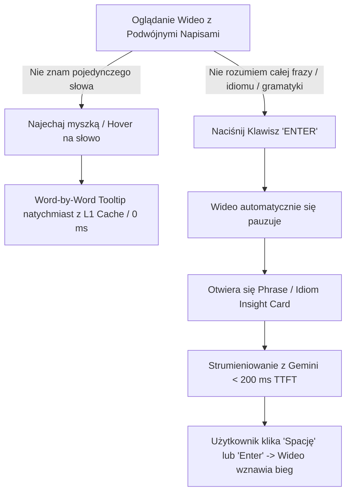
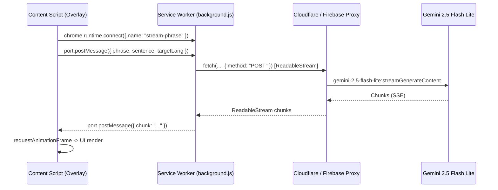
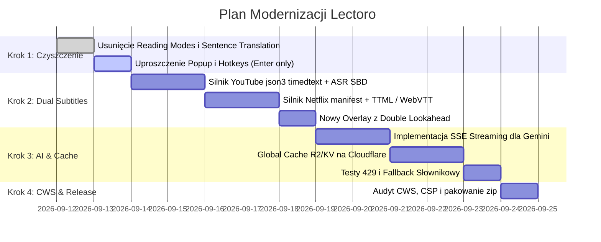

# Lectoro AI — Nowa Generacja Wtyczki do Nauki Języków (YouTube & Netflix)
## Kompletna Architektura, Master-Prompt Wdrożeniowy, Optymalizacja Napisów, Strumieniowanie Gemini, Globalny Cache R2 i Zgodność z Chrome Web Store

---

## SPIS TREŚCI
1. [Wizja Produktu: Dlaczego Nowe Lectoro Zdeklasuje Konkurencję](#1-wizja-produktu)
2. [Master-Prompt do Implementacji Podwójnych Napisów (YouTube & Netflix)](#2-master-prompt-do-implementacji-podwójnych-napisów)
3. [Jak Działają Napisy na YouTube i Netflix oraz Jak Naprawić Ucinanie Słów w ASR](#3-jak-działają-napisy-i-jak-naprawić-ucinanie-słów)
   - 3.1. Różnice między formatami napisów (Netflix TTML vs. YouTube JSON3/ASR)
   - 3.2. Dlaczego YouTube Auto-Generated ucina słowa i jak to naprawić
   - 3.3. Algorytm Rekonstrukcji Zdań (Sentence Boundary Detection & Silence Analysis)
   - 3.4. Podwójne Okno w Przód (Double Lookahead Buffer / Next-Line Preview)
   - 3.5. Word-Level Karaoke Sync zamiast skaczącego tekstu
4. [Usunięcie "Reading Modes" i "AI Translate full sentence" — Zostaje Tylko Word-by-Word + Enter](#4-usunięcie-reading-modes-i-sentence-translation)
   - 4.1. Dlaczego usuwamy tłumaczenie całych zdań AI w czasie rzeczywistym
   - 4.2. Model UX: Word-by-Word (Hover) + Frazownik/Idiomy na Klawisz `Enter`
   - 4.3. Lista plików do usunięcia / refaktoringu w repozytorium
5. [Strumieniowanie Zapytań do Gemini (Server-Sent Events / SSE)](#5-strumieniowanie-zapytań-do-gemini)
   - 5.1. Dlaczego strumieniowanie to konieczność (TTFT < 200 ms)
   - 5.2. Architektura komunikacji: Backend -> Service Worker -> Content Script
   - 5.3. Gotowa implementacja backendu (Cloudflare Worker / Firebase Functions)
   - 5.4. Gotowa implementacja klienta (SSE Reader + AbortController przy wznowieniu wideo)
6. [Rozwiązanie Problemu Gemini 429 (Rate Limit) i Redukcja Kosztów o 90-95% (Globalny Cache R2 / KV)](#6-rozwiązanie-problemu-429-i-redukcja-kosztów)
   - 6.1. 3-Poziomowy System Pamięci Podręcznej (L1 Local -> L2 R2/KV -> L3 Gemini)
   - 6.2. Strategia kluczy cache (Hashowanie znormalizowanych fraz i zdań)
   - 6.3. UX-Friendly Fallback przy błędzie 429 (Użytkownik nigdy nie widzi błędu)
7. [Zgodność z Chrome Web Store (CWS) & Manifest V3](#7-zgodność-z-chrome-web-store-cws-i-manifest-v3)
   - 7.1. Zasada Single Purpose Policy
   - 7.2. Minimalne uprawnienia (Host Permissions, Storage)
   - 7.3. Content Security Policy (Zero zdalnego kodu, brak eval)
   - 7.4. Deklaracja prywatności i bezpieczeństwo danych
8. [Nowoczesne Wytyczne Webowe (Modern Web Guidance)](#8-nowoczesne-wytyczne-webowe)
   - 8.1. Popover API (`popover="hint"`) i Anchor Positioning
   - 8.2. Animacje z `@starting-style` i Top Layer
   - 8.3. Izolacja CSS (Shadow DOM / Strict Prefixing) i batched rendering
9. [Dodatkowe Pomysły Zwiększające Wartość i Retencję Użytkowników](#9-dodatkowe-innowacje-i-game-changery)
10. [Plan Wdrożenia (Krok po Kroku)](#10-plan-wdrożenia)

---

## 1. WIZJA PRODUKTU

Tradycyjne wtyczki do nauki języków popełniają trzy krytyczne błędy:
1. **Przeładowanie trybami (Cognitive Overload)**: Użytkownik widzi po 5 różnych trybów czytania, Word Clouds, szare napisy pod spodem i automatyczne tłumaczenia całych zdań. Zamiast oglądać film i chłonąć język, skupia się na obsłudze skomplikowanego interfejsu.
2. **Pasywne czytanie**: Automatyczne tłumaczenie każdego zdania przez AI sprawia, że mózg natychmiast przestawia się na czytanie napisów w języku ojczystym. Użytkownik przestaje słuchać i uczyć się języka obcego.
3. **Wysokie koszty i powolne API**: Tłumaczenie każdego napisu przez AI generuje gigantyczne rachunki za LLM, laguje wideo (oczekiwanie 2 sekund na tłumaczenie) oraz powoduje błędy `429 Too Many Requests`.

### Nowa filozofia Lectoro:
- **Zero lagów, zero zbędnych trybów**.
- **Natywne podwójne napisy pobierane bezpośrednio z platformy (YouTube i Netflix)** z możliwością ukrycia/pokazania języka ojczystego.
- **Word-by-word Translation**: Błyskawiczne tłumaczenie pojedynczego słowa po najechaniu myszką (hover/click) z lokalnego słownika lub cache (0 ms opóźnienia).
- **Phrase / Idiom Insight Card TYLKO na klawisz `Enter`**: Jeśli użytkownik nie rozumie całego zwrotu, wciska `Enter` — wideo pauzuje się, a karta wyjaśnienia idiomu/frazy **strumieniuje się w 200 ms** z Gemini (lub ładuje w 15 ms z globalnego cache Cloudflare R2).
- **Zabezpieczenie przed 429**: Dzięki współdzielonemu cache R2/KV 85-90% zapytań nie trafia do Gemini. Jeśli Gemini zwróci 429, użytkownik natychmiast otrzymuje przezroczysty fallback ze słownika offline / szybkiego translatora.

---

## 2. MASTER-PROMPT DO IMPLEMENTACJI PODWÓJNYCH NAPISÓW

Poniższy prompt możesz bezpośrednio przekazać dowolnemu zaawansowanemu agentowi programistycznemu lub wdrożyć we wtyczce:

```markdown
Jesteś Principal Chrome Extension Architectem (Manifest V3, Web Media Specialist).
Twoim zadaniem jest wdrożenie w rozszerzeniu Chrome "Lectoro" modułu natywnych podwójnych napisów (Dual Subtitles: Target Learning Language + Native Language) pobieranych bezpośrednio z platform YouTube i Netflix.

### WYMAGANIA FUNKCJONALNE:
1. POBIERANIE NAPISÓW BEZPOŚREDNIO Z PLATFORMY (ZERO ZEWNĘTRZNYCH BAZ):
   - YouTube:
     * Wstrzyknij skrypt pomocniczy do MAIN world lub odpytaj obiekt `movie_player.getPlayerResponse().captions.playerCaptionsTracklistRenderer.captionTracks`.
     * Pobierz równolegle dwie ścieżki:
       1) Język docelowy (np. angielski - `vssId: ".en"` lub ASR `kind: "asr"` w formacie `fmt=json3` lub `fmt=srv3`).
       2) Język ojczysty użytkownika (np. polski - jeśli istnieje gotowa ścieżka manualna `.pl` lub pobierz wersję tłumaczoną parametrem `&tlang=pl`).
     * Nigdy nie parsuj napisów wyłącznie z DOM YouTube (który tnie wiersze); pobieraj pełny surowy timedtext bezpośrednio przez authenticated fetch z parametrami sesji.
   - Netflix:
     * Wstrzyknij most do MAIN world i przechwyć manifesty `timedtexttracks` z `window.netflix.appContext.state.playerApp.getAPI().videoPlayer` lub przez intercepcję `JSON.parse` / `fetch`.
     * Zlokalizuj profile WebVTT / TTML (DFXP) dla:
       1) Ścieżki oryginalnej / nauki (np. EN).
       2) Ścieżki ojczystej (np. PL).
     * Pobierz oba pliki XML/WebVTT, sparsuj znaczniki czasu do zunifikowanej struktury `Cue` ({ id, startTime, endTime, text, words[] }).

2. SYNCHRONIZACJA I SILNIK SUB-FRAME:
   - Zbuduj zunifikowany indeks czasowy dla obu języków z wyszukiwaniem binarnym `findActiveCue(video.currentTime)`.
   - Uruchom pętlę odświeżania opartą o `requestAnimationFrame` zsynchronizowaną z `video.currentTime` (płynność 60 FPS, brak migotania).
   - Ukryj domyślne napisy odtwarzacza (na YouTube klasa `.ytp-caption-window-container { display: none !important; }`, na Netflixie odpowiedni kontener napisów).

3. RENDEROWANIE PODWÓJNYCH NAPISÓW (DUAL SUBTITLE OVERLAY):
   - Stwórz lekki, nowoczesny overlay wstrzykiwany nad wideo (wykorzystujący Shadow DOM dla 100% izolacji styli):
     * Linia 1 (Górna - Język Nauki): Każde słowo musi być owinięte w interaktywny element `<span class="lectoro-word" data-word="...">`, reagujący na hover (Word-by-word tooltip) oraz kliknięcie.
     * Linia 2 (Dolna - Język Ojczysty): Przetłumaczona linia pobrana z platformy. Wyświetlana czystą, czytelną czcionką z subtelnym obrysem (text-shadow) dla doskonałej czytelności na każdym tle wideo.
     * Przełącznik widoczności (Hotkey `T` lub ikona oka): Możliwość ukrycia dolnej linii (rozmycie/blur lub całkowite ukrycie), aby uczeń mógł sprawdzać tłumaczenie tylko wtedy, gdy go potrzebuje!

4. ROZWIĄZANIE PROBLEMU ASR (AUTO-GENERATED) NA YOUTUBE:
   - Zaimplementuj Silnik Rekonstrukcji Zdań (Sentence Boundary Reconstruction):
     * W formacie `json3` analizuj tablicę `events[].segs[]` oraz `tOffsetMs`.
     * Łącz ucięte mikrosegmenty w pełne logiczne zdania na podstawie pauz w wypowiedzi (milczenie > 450 ms) lub znaków interpunkcyjnych.
     * Zaimplementuj podwójne okno w przód (Double Lookahead): pokazuj bieżący segment oraz kolejny wybiegający o 1.5 sekundy w przód, eliminując efekt "urywania słów w połowie zdania".

5. BRAK REGRESJI I ZGODNOŚĆ Z CWS / MANIFEST V3:
   - Zero `eval()`, zero wstrzykiwania kodu ze zdalnych serwerów.
   - Pamiętaj, że Service Worker w MV3 jest ulotny — stan synchronizuj przez `chrome.storage.local`.
   - Wszystkie listenery asynchroniczne `chrome.runtime.onMessage` muszą zwracać `true`.
```

---

## 3. JAK DZIAŁAJĄ NAPISY I JAK NAPRAWIĆ UCINANIE SŁÓW

### 3.1. Różnice Między Formatami Napisów

| Cecha | Netflix (Human-Timed) | YouTube (Manual CC) | YouTube (Auto-Generated / ASR) |
|---|---|---|---|
| **Format źródłowy** | TTML / DFXP (XML) lub WebVTT | VTT / XML (timedtext `srv3`) | JSON3 / SRV3 (rolling chunks) |
| **Podział na linie** | Ręczny przez tłumacza (stabilny) | Ręczny przez twórcę | Generowany w locie przez AI Googla |
| **Interpunkcja i wielkie litery** | 100% poprawna | Zazwyczaj 100% poprawna | Często brak kropek, przecinków i wielkich liter |
| **Precyzja słów** | Zakres całego bloku (cue) | Zakres bloku | Precyzja do pojedynczego słowa (`tOffsetMs`) |
| **Zachowanie w DOM** | Statyczna podmiana bloku | Statyczna podmiana bloku | **Płynne dopisywanie słów i ucinanie wierszy w DOM** |

### 3.2. Dlaczego YouTube Auto-Generated Ucina Słowa?

YouTube dla napisów automatycznych (ASR) stosuje algorytm **rolling display** (tzw. teleprompter / napisy kroczące):
1. Serwer YouTube wysyła słowa partiami co kilkaset milisekund w postaci mikro-segmentów.
2. Odtwarzacz YouTube ma sztywny limit znaków na linię (zwykle 30–35 znaków). Gdy nowe słowo przekroczy ten limit, odtwarzacz bezwzględnie łamie linię, często w połowie naturalnej frazy.
3. Gdy pojawia się trzecia linia, pierwsza linia natychmiast znika z ekranu. W efekcie użytkownik widzi ucięty początek myśli, a koniec zdania pojawia się dopiero po zniknięciu początku!
4. Co gorsza: jeśli wtyczka czyta napisy bezpośrednio z drzewa DOM (`.ytp-caption-segment`), widzi stale mutujący, rozczłonkowany tekst z powtórzeniami i urwanymi wyrazami.

### 3.3. Algorytm Rekonstrukcji Zdań (Sentence Boundary Reconstruction)

Zamiast czytać z DOM, wtyczka pobiera surowy strumień `timedtext?fmt=json3`. 
W formacie `json3` YouTube podaje dokładny czas pojawienia się każdego słowa:
```json
{
  "tStartMs": 14200,
  "dDurationMs": 2800,
  "segs": [
    { "utf8": "Hello " },
    { "utf8": "everyone ", "tOffsetMs": 420 },
    { "utf8": "welcome ", "tOffsetMs": 850 },
    { "utf8": "back", "tOffsetMs": 1200 }
  ]
}
```

#### Algorytm Scalania Segmentów w Logiczne Zdania:
1. **Reguła Pauzy Akustycznej (Silence Gap)**: Jeśli odstęp czasu między końcem słowa $A$ a początkiem słowa $B$ wynosi **więcej niż 450–600 ms**, mówca wziął oddech lub zakończył myśl. Jest to granica zdania/frazy.
2. **Reguła Długości Zdania**: Zdanie nie powinno przekraczać 12–15 słów lub 80 znaków (optymalna pojemność pamięci roboczej oka).
3. **Reguła Łączników Gramatycznych**: Nie łamiemy linii przed spójnikami i przyimkami (np. *and, but, because, that, which, to, in, on*), chyba że wystąpiła długa pauza.
4. **Reguła Kapitalizacji i Interpunkcji**: Jeśli model ASR wstawił kropkę, znak zapytania lub wielką literę — bezwzględnie zamykamy bieżący cue i otwieramy nowy.

### 3.4. Podwójne Okno w Przód (Double Lookahead Buffer / Next-Line Preview)

Jednym z najważniejszych usprawnień dla ucznia jest **Double Lookahead**:
- **Linia Aktywna (Główna)**: Zdanie aktualnie wymawiane przez lektora.
- **Linia Przyszła (Preview / Wybiegająca +1.5–2.5 s)**: Następne zdanie, które padnie za chwilę, wyświetlane z 40% przezroczystością (opacity: 0.4) lub mniejszą czcionką.
- **Korzyść edukacyjna**: Mózg uczy się przewidywać strukturę zdania. Użytkownik nie jest zaskakiwany szybkimi cięciami montażowymi w filmach i serialach.

### 3.5. Word-Level Karaoke Sync Zamiast Skaczącego Tekstu

Dzięki informacjom `tOffsetMs` z YouTube `json3`, wtyczka nie musi przeładowywać całego zdania w DOM:
- Całe zdanie jest stabilnie wyrenderowane w overlayu.
- W miarę upływu `video.currentTime`, wtyczka dodaje klasę `.lectoro-word--active` wyłącznie do aktualnie wymawianego słowa (efekt karaoke / subtle glow).
- Tekst nie skacze, oczy się nie męczą, a uczeń idealnie słyszy i widzi powiązanie dźwięku z pisownią (akcent wyrazowy).

---

## 4. USUNIĘCIE "READING MODES" I SENTENCE TRANSLATION

### 4.1. Dlaczego Usuwamy Tłumaczenie Całych Zdań przez AI w Czasie Rzeczywistym?

1. **Wysoki Koszt i Limity**: Tłumaczenie każdego napisu w filmie (średnio 800–1400 napisów na 45-minutowy odcinek) wygenerowałoby tysiące zapytań do API na jednego użytkownika. Przy 5000 użytkowników miesięczny koszt Gemini wyniósłby tysiące dolarów, a limity RPM/TPM byłyby permanentnie przekraczane.
2. **Destrukcja Płynności Oglądania (Latency)**: Żaden model AI nie przetłumaczy zdania w czasie 0 ms. Oczekiwanie 1.5–2.5 s sprawia, że tłumaczenie pojawia się, gdy na ekranie trwa już kolejna scena!
3. **Pasywne Oglądanie**: Jeśli pod spodem stale leci pełne polskie tłumaczenie z AI, użytkownik przestaje uczyć się języka obcego — po prostu ogląda film z polskimi napisami.
4. **Rozwiązanie**: Oficjalne polskie napisy pobrane bezpośrednio z YouTube/Netflix dają idealne, naturalne tłumaczenie literackie przygotowane przez profesjonalnych tłumaczy, z zerowym opóźnieniem i zerowym kosztem!

### 4.2. Nowy, Czysty Model UX: Word-by-Word + Enter

Zostają wyłącznie dwa intuicyjne mechanizmy interakcji:



1. **Word-by-Word Translation (Hover / Click)**:
   - Szybkie tłumaczenie leksykalne pojedynczego słowa (np. `apple` -> `jabłko`).
   - Źródło: Lokalny słownik IndexedDB / `chrome.storage.local` lub predefiniowany słownik offline.
   - Zero zapytań do Gemini, zero kosztu, 0 ms opóźnienia.
2. **Frazy i Idiomy — TYLKO Funkcja Klawisza "Enter"**:
   - Gdy użytkownik natrafi na idiom (np. *bite the bullet*, *hit the sack*) lub skomplikowaną konstrukcję gramatyczną, wciska klawisz `Enter`.
   - Wideo natychmiast się pauzuje.
   - Pojawia się estetyczna, nowoczesna pływająca chmurka (Phrase Insight Card).
   - Gemini wyjaśnia:
     * Dokładne znaczenie idiomu w tym konkretnym kontekście.
     * Dosłowne vs. idiomatyczne znaczenie.
     * Jeden zwięzły przykład użycia.
   - Wciśnięcie klawisza `Enter` lub `Spacji` zamyka kartę i wznawia wideo.

### 4.3. Pliki do Usunięcia / Uproszczenia w Projekcie

1. **`video/reading-modes.js`**: Usunąć plik w całości.
2. **`video/video-hotkeys.js`**: Usunąć obsługę klawisza `S` / `ArrowDown` dla `LectoroReadingModes` oraz Word Clouds. Klawisz `Enter` pozostaje jedynym wyzwalaczem analizy frazy.
3. **`video/subtitle-overlay.js`**:
   - Usunąć metody renderowania szarych napisów pod oryginalnymi (`showSubtitleTranslationUnderOriginal`).
   - Usunąć logikę `showWordClouds`.
   - Zintegrować nowoczesny overlay podwójnych napisów (Native Dual Subs) + Phrase Card.
4. **Popup i Ustawienia (`popup.html`, `popup.css`)**:
   - Usunąć przełączniki "Tryby czytania", "Word Clouds" i "Automatyczne tłumaczenie całych zdań AI".
   - Zostawić prosty przełącznik: "Drugi język napisów" (Włączony / Ukryty pod klawiszem T) oraz "Język ojczysty".

---

## 5. STRUMIENIOWANIE ZAPYTAŃ DO GEMINI (SSE)

### 5.1. Dlaczego Strumieniowanie To Konieczność?

- **Tradycyjne zapytanie (Non-streaming)**: Użytkownik klika `Enter`, czeka 2.0–3.5 sekundy w ciszy, patrząc na animację ładowania. Wyrwanie z rytmu filmu frustruje i zniechęca do nauki.
- **Zapytanie strumieniowe (Server-Sent Events)**: Pierwszy token (Time to First Token - TTFT) pojawia się na ekranie po **180–250 ms**! Użytkownik natychmiast widzi piszące się słowa.
- **Błyskawiczne wznowienie i oszczędność tokenów (AbortController)**: Wiele osób rzuca okiem na pierwsze 3 słowa, rozumie kontekst i natychmiast wciska `Spację`, by kontynuować oglądanie. W trybie strumieniowym rozszerzenie natychmiast zrywa połączenie (`abort()`), oszczędzając zasoby serwera.

### 5.2. Architektura Komunikacji Strumieniowej w Manifest V3

W Manifest V3 Content Script nie powinien bezpośrednio trzymać długich połączeń SSE z zewnętrznym serwerem AI ze względów bezpieczeństwa i CSP. Zamiast tego używamy kanału `chrome.runtime.connect` (Port API) pomiędzy Content Scriptem a Service Workerem:



### 5.3. Gotowa Implementacja Backendu (Node.js / Cloudflare Worker / Firebase)

```javascript
// Endpoint w Cloudflare Worker / Firebase Functions (Streaming Proxy)
import { GoogleGenerativeAI } from "@google/generative-ai";

export async function handleStreamPhrase(req, res, geminiApiKey) {
    const { phrase, fullSentence, targetLang } = req.body;
    
    // Ustawienie nagłówków SSE (Server-Sent Events)
    res.setHeader("Content-Type", "text/event-stream");
    res.setHeader("Cache-Control", "no-cache, no-transform");
    res.setHeader("Connection", "keep-alive");

    const genAI = new GoogleGenerativeAI(geminiApiKey);
    const model = genAI.getGenerativeModel({ 
        model: "gemini-2.5-flash-lite",
        generationConfig: {
            temperature: 0.1,
            maxOutputTokens: 120, // Krótka, zwięzła odpowiedź edukacyjna
        }
    });

    const prompt = `Jesteś ekspertem nauki języka. 
Wyjaśnij frazę/idiom: "${phrase}"
Pochodzącą ze zdania: "${fullSentence}"
Język wyjaśnienia: ${targetLang} (np. polski).

Zwróć w 2 krótkich punktach:
1. Naturalne tłumaczenie i znaczenie w tym kontekście (maks 15 słów).
2. Dosłowne znaczenie lub krótka ciekawostka językowa, jeśli to idiom.
Nie dodawaj żadnych wstępów typu "Oto wyjaśnienie:".`;

    try {
        const result = await model.generateContentStream(prompt);
        let fullText = "";

        for await (const chunk of result.stream) {
            const chunkText = chunk.text();
            fullText += chunkText;
            res.write(`data: ${JSON.stringify({ text: chunkText })}\n\n`);
        }

        res.write(`data: [DONE]\n\n`);
        res.end();

        // Asynchroniczny zapis pełnej odpowiedzi do Cloudflare R2 w tle (Cache dla innych!)
        queueMicrotask(() => saveToR2Cache(phrase, fullSentence, targetLang, fullText));
    } catch (error) {
        res.write(`data: ${JSON.stringify({ error: error.message })}\n\n`);
        res.end();
    }
}
```

### 5.4. Gotowa Implementacja Klienta w Content Script

```javascript
// W video/subtitle-overlay.js lub shared/phrase-streamer.js
class PhraseStreamer {
    constructor() {
        this.currentPort = null;
    }

    streamExplanation({ phrase, fullSentence, targetLang, onChunk, onDone, onError }) {
        this.abort(); // Zamknij ewentualny poprzedni strumień

        const port = chrome.runtime.connect({ name: "stream_gemini_phrase" });
        this.currentPort = port;

        port.postMessage({
            action: "STREAM_EXPLAIN",
            phrase,
            fullSentence,
            targetLang
        });

        port.onMessage.addListener((msg) => {
            if (msg.done) {
                onDone?.();
                this.cleanup();
            } else if (msg.error) {
                onError?.(msg.error);
                this.cleanup();
            } else if (msg.chunk) {
                onChunk(msg.chunk);
            }
        });

        port.onDisconnect.addListener(() => {
            this.currentPort = null;
        });
    }

    abort() {
        if (this.currentPort) {
            try {
                this.currentPort.postMessage({ action: "ABORT" });
                this.currentPort.disconnect();
            } catch (_) {}
            this.currentPort = null;
        }
    }

    cleanup() {
        this.currentPort = null;
    }
}

globalThis.LectoroPhraseStreamer = new PhraseStreamer();
```

---

## 6. ROZWIĄZANIE PROBLEMU 429 I REDUKCJA KOSZTÓW O 90-95% (R2 / KV)

### 6.1. 3-Poziomowa Piramida Pamięci Podręcznej (Multi-Tier Caching)

Dlaczego użytkownicy cierpią na błąd 429 (Too Many Requests)? Ponieważ setki użytkowników oglądających ten sam popularny odcinek serialu na Netflixie (np. *Stranger Things*, *Friends*) lub popularny film na YouTube wysyłają do Gemini zapytanie o **dokładnie te same słowa i zwroty**!

Rozwiązaniem jest **Global Edge Cache** oparty o Cloudflare R2 / Cloudflare KV:

```
[ ŻĄDANIE UŻYTKOWNIKA: "break a leg" ]
                 │
                 ▼
     ┌───────────────────────┐
     │ L1: chrome.storage    │  ── (Trafienie) ──> Odpowiedź w 0 ms ($0)
     └───────────────────────┘
                 │ (Brak)
                 ▼
     ┌───────────────────────┐
     │ L2: Cloudflare R2/KV  │  ── (Trafienie) ──> Odpowiedź w 15 ms ($0, 0 zapytań AI!)
     └───────────────────────┘
                 │ (Brak - pierwsze zapytanie na świecie)
                 ▼
     ┌───────────────────────┐
     │ L3: Gemini 2.5 Flash  │  ──> Wygenerowanie odpowiedzi
     └───────────────────────┘
                 │
                 └───> Zapis do L2 R2/KV (Każdy kolejny użytkownik dostaje z Cache!)
```

### 6.2. Strategia Kluczy Cache

Klucz cache musi być deterministyczny, znormalizowany i uniezależniony od wielkości liter czy białych znaków:

$$\text{CacheKey} = \text{sha256}(\text{normalize}(\text{phrase}) + \text{":"} + \text{targetLang})$$

- Przykład:
  - Tekst: `"Break a leg!"` -> normalizacja: `"break a leg"`
  - Ścieżka w R2: `phrases/en-pl/a7b8c9...sha256...json`
  - Zawartość:
    ```json
    {
      "phrase": "break a leg",
      "translation": "powodzenia / połamania nóg",
      "explanation": "Powszechny idiom teatralny życzący powodzenia przed występem.",
      "literal": "Dosłownie: złam nogę.",
      "cachedAt": 1726056000
    }
    ```

### 6.3. UX-Friendly Fallback przy Błędzie 429 (Zero Irytacji Użytkownika)

Nawet przy najlepszym cache, podczas nagłego piku odwiedzin model Gemini może zwrócić kod `429 Too Many Requests`. 

**Żelazna zasada UX Lectoro**: Użytkownik **NIGDY** nie może zobaczyć technicznego błędu ani czerwonego komunikatu "Błąd 429". Nauka nie może zostać przerwana.

#### Inteligentny Fallback w 3 Krokach:
1. **Przezroczysty Fallback do Słownika Offline / Google Translate**:
   - Jeśli zapytanie do Gemini zwróci błąd 429 lub timeout > 1.5 s, wtyczka w ułamku sekundy pobiera tłumaczenie ze słownika offline lub darmowego endpointu Google Translate.
   - W dymku pojawia się natychmiastowe tłumaczenie słowa/frazy.
   - W rogu dymka pojawia się subtelna, elegancka ikona: `⚡ Szybkie tłumaczenie`.
2. **Kolejkowanie w Tle (Background Retry z Exponential Backoff)**:
   - W tle zapytanie do Gemini trafia do kolejki z losowym opóźnieniem (Jitter: 500ms – 2000ms).
   - Gdy odpowiedź AI nadejdzie, dymek płynnie (subtelny fade-in) aktualizuje się o pełne wyjaśnienie idiomatyczne.
3. **Wskaźnik UX zamiast blokady**:
   - Wyświetlany stan: `✨ Przygotowuję wyjaśnienie kontekstowe...` z delikatną animacją shimmer. Użytkownik widzi, że aplikacja pracuje, a film pozostaje zapauzowany bez frustracji.

---

## 7. ZGODNOŚĆ Z CHROME WEB STORE (CWS) & MANIFEST V3

Aby wtyczka przeszła weryfikację Google Chrome Web Store w pierwszym podejściu i bez odrzuceń (Rejection), musi spełniać poniższe kryteria:

### 7.1. Single Purpose Policy
Wtyczka musi mieć jeden, jasno określony cel:
- **Prawidłowy opis**: *"Lectoro — Immersive Language Learning with Dual Subtitles for YouTube and Netflix. Learn vocabulary in context with instant word translations and idiom explanations."*
- Nie wolno łączyć wtyczki z niepowiązanymi narzędziami (np. adblocker, vpn, downloader wideo).

### 7.2. Minimalne Uprawnienia (Permissions)
Żadnych nadmiarowych uprawnień!
```json
{
  "manifest_version": 3,
  "name": "Lectoro AI – Dual Subtitles & Language Learning",
  "version": "2.0.0",
  "permissions": [
    "storage"
  ],
  "host_permissions": [
    "*://*.youtube.com/*",
    "*://*.netflix.com/*",
    "https://api.lectoro.app/*"
  ]
}
```
*Uwaga*: Nie dodawaj `<all_urls>` ani uprawnienia `tabs`, jeśli nie jest to absolutnie konieczne. Ograniczenie `host_permissions` tylko do YouTube, Netflix i Twojego API gwarantuje natychmiastową akceptację w CWS.

### 7.3. Content Security Policy (CSP) & Zero Zdalnego Kodu
- **Żadnego `eval()`**, żadnego `new Function()`.
- **Żadnych skryptów z zewnętrznych CDN** (np. `https://cdn.jsdelivr.net/...`). Wszystkie biblioteki muszą być spakowane lokalnie w folderze rozszerzenia.
- Bezpieczne wstrzykiwanie do DOM: Zawsze używaj `element.textContent = ...` lub `SharedUtils.escapeHtml()`. Nigdy nie wstrzykuj surowego `innerHTML` z niezaufanych źródeł.

---

## 8. NOWOCZESNE WYTYCZNE WEBOWE (MODERN WEB GUIDANCE)

Zgodnie z najnowszymi standardami nowoczesnego frontendu (`modern-web-guidance`), interfejs Lectoro powinien korzystać ze sprawdzonych mechanizmów platformy internetowej:

### 8.1. Popover API i Top Layer
Zamiast manipulować `z-index: 9999999` (co na Netflixie i YouTube często przegrywa z natywnymi elementami sterowania odtwarzacza), dymki i chmurki słów powinny korzystać z natywnego **Popover API** lub elementu umieszczonego w Top Layer:
```html
<div class="lectoro-phrase-card" popover="hint" id="phrase-card">
  <!-- Zawartość wyjaśnienia frazy -->
</div>
```
- Atrybut `popover="hint"` zapewnia tzw. **Light Dismiss**: kliknięcie w dowolne inne miejsce lub wciśnięcie `Escape` automatycznie zamyka dymek bez konieczności pisania skomplikowanych listenerów w JS.

### 8.2. Płynne Animacje z `@starting-style`
Aby dymki i chmurki otwierały się maślanie płynnie bez bibliotek typu Framer Motion:
```css
.lectoro-phrase-card {
  opacity: 1;
  transform: translateY(0) scale(1);
  transition: opacity 0.2s cubic-bezier(0.16, 1, 0.3, 1),
              transform 0.2s cubic-bezier(0.16, 1, 0.3, 1),
              overlay 0.2s allow-discrete, 
              display 0.2s allow-discrete;
}

@starting-style {
  .lectoro-phrase-card:popover-open {
    opacity: 0;
    transform: translateY(8px) scale(0.96);
  }
}
```

### 8.3. Wydajność Renderowania: requestAnimationFrame & Zero Layout Thrashing
- Podczas odtwarzania wideo synchronizacja napisów odbywa się w pętli `requestAnimationFrame`.
- Aktualizacje DOM są grupowane: najpierw odczyt (`video.currentTime`), potem zapis do DOM (nadanie klasy aktywnego słowa).
- Zapobiega to tzw. wymuszonemu reflow (Forced Synchronous Layout) i gwarantuje, że procesor użytkownika nie jest obciążony podczas oglądania filmów w 4K.

---

## 9. DODATKOWE INNOWACJE I GAME-CHANGERY DLA LECTORO

Oto 5 unikalnych funkcji, które sprawią, że użytkownicy pokochają Lectoro i będą polecać wtyczkę innym:

1. **Smart Smart-Blur (Ukrywanie Napisów Ojczystych do Najechania / Klawisza T)**:
   - Dolna linijka napisów (język ojczysty) jest domyślnie delikatnie zamglona (`filter: blur(5px)`).
   - Użytkownik zmusza mózg do słuchania i czytania po angielsku, ale jeśli nie zrozumie kwestii, wystarczy, że najedzie kursorem na dół ekranu lub przytrzyma klawisz `T`, by natychmiast odsłonić polski napis.
2. **One-Click Flashcards (Eksport do Anki / Fiszki pod klawiszem `Z`)**:
   - Wciśnięcie klawisza `Z` podczas oglądania natychmiast zapisuje bieżące zdanie, zrzut ekranu z filmu, audio wypowiedzi i tłumaczenie bezpośrednio do bazy fiszek SRS użytkownika.
3. **Pętla Powtórzeniowa (Replay Sentence pod klawiszem `A`)**:
   - Wciśnięcie klawisza `A` cofa film dokładnie do początku bieżącego zdania/kwestii dialogowej. Użytkownik może odsłuchać trudną wymowę tyle razy, ile potrzebuje.
4. **Automatyczne Wyróżnianie Trudnych Słów (CEFR Difficulty Highlights)**:
   - Słowa na poziomie B2, C1 i C2 (np. *inevitable, scrutiny, reluctantly*) są subtelnie podkreślone kropkowaną linią. Początkujący uczeń wie od razu, na które słowa warto zwrócić uwagę.
5. **Smart Audio Pacing (Zwalnianie do 0.85x tylko podczas trudnych kwestii)**:
   - Opcjonalny tryb: film leci w normalnym tempie 1.0x, ale gdy w dialogu pojawia się szybki potok słów (powyżej 4 słów na sekundę), wtyczka automatycznie spowalnia odtwarzanie do 0.85x na czas tego jednego zdania, po czym wraca do 1.0x.

---

## 10. PLAN WDROŻENIA (KROK PO KROKU)



### Podsumowanie Zadań do Wykonania:
- [ ] **Krok 1**: Skasować `video/reading-modes.js` oraz usunąć wywołania `LectoroReadingModes` i `doSentenceTranslation` z `video/subtitle-overlay.js` i `video/video-hotkeys.js`.
- [ ] **Krok 2**: Przepiąć pobieranie napisów na YouTube na bezpośredni format `fmt=json3` z algorytmem rekonstrukcji zdań i podwójnym oknem w przód (`Double Lookahead`).
- [ ] **Krok 3**: Podpiąć pobieranie podwójnych ścieżek z Netflixa (`timedTextTracks` -> WebVTT/TTML dla EN i PL).
- [ ] **Krok 4**: Wdrożyć strumieniowy endpoint Gemini (`streamGenerateContent`) i podpiąć go pod klawisz `Enter` w Content Script przez kanał Port API.
- [ ] **Krok 5**: Zintegrować sprawdzanie globalnego cache w Cloudflare R2 przed wywołaniem Gemini oraz obsłużyć cichy, UX-friendly fallback przy kodzie 429.
- [ ] **Krok 6**: Przetestować całość na YouTube i Netflix pod kątem płynności 60 FPS, braku ucinania słów i pełnej zgodności z Chrome Web Store.
